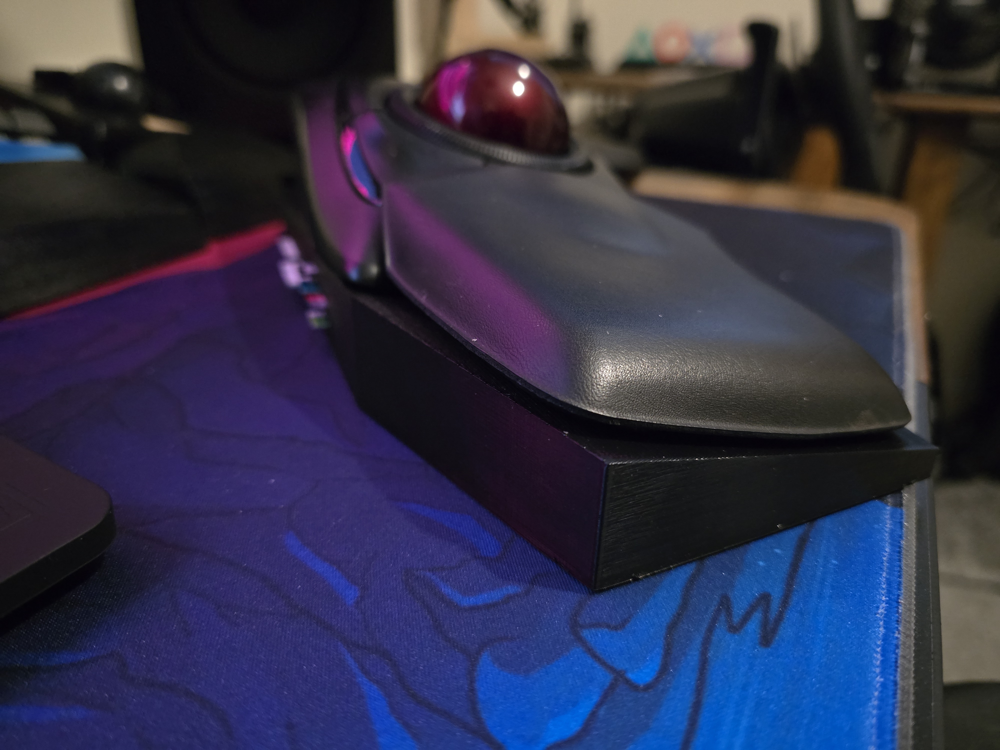
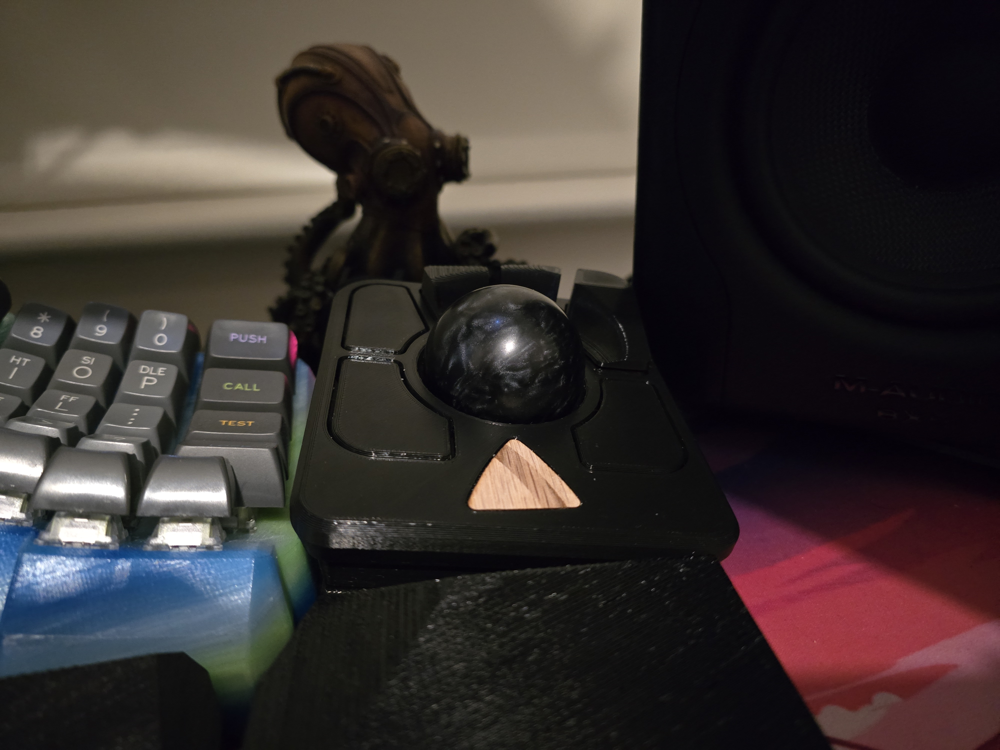

# ArtiomSu-TrackBall-Comparisons-And-Mods

This repo contains information about all the trackballs I have used and any mods. You can find stl files for 3d printing here too if they are modified by me.

Currently its Kensington Expert Wireless vs Elecom Huge Wireless vs Ploopy Adept

I only use trackballs for basic navigation and sometimes in blender too on 3 different OSes, Linux for pleasure, Macos for work, Windows for gaming + HDR content. 

I still use a mouse for gaming so if you are looking specifically for a gaming comparison this isn't for you. 

# Spec Comparisons

|                   | Kensington Expert Wireless | Elecom Huge Wireless | Ploopy Adept | Additional Notes |
| ----------------- | -------------------------- | -------------------- | ------------ | ---------------- |
| USB cable         | No                         | No                   | Yes          |                  |
| Bluetooth         | Yes                        | No                   | No           |                  |
| 2.4GHz Dongle     | Yes with built in storage  | Yes with built in storage | No      | Some people complain about the elecom one losing signal but I have had no issues with it, maybe I have a newer hardware version |
| Number of Buttons | 4                          | 8 + 2 scroll wheel tilt ones + dpi switch                  | 6            | More buttons on the Elecom Huge is handy if you are gaming with it |
| Scrolling         | Scroll Ring                | Normal mouse scroll wheel | Hold button + Ball to scroll | The scroll ring is a good idea but it doesn't feel good to use, it is not smooth. If it was higher quality it would probably be the best in the scrolling category. Ploopy essentially has a software scroll and it is the smoothest out of them all. You can actually configure something like the ploopy software scrolling for the other two but only on linux see my scripts for [Kensington Expert](https://github.com/ArtiomSu/kensington-expert-trackball-linux-config) and [Elecom Huge](https://github.com/ArtiomSu/elecom-huge-trackball-linux-config) |
| Power             | 2x AA batteries            | 2x AA batteries      | Usb cable    | The batteries last for months with these so there isn't really any dissadvantage |
| Ball Size         | 55mm                       | 52mm                 | 44.45mm      | I think the bigger the ball the better. It is more comfortable. But it does require slightly more force to turn. So if you want quick movements (like in fps game or something) then a smaller ball will offer an advantage. |
| Falling apart     | Ball + wrist rest can fall off | Nothing falls out | Ball + maybe bearing can fall out | This is bassically if you were to put these into your bag, how may pieces will fall out. The elecom huge ball is friction fit so you will need a good bit of force to make it fall out. Overall if you are travelling alot, the Elecom huge is your best bet at staying together |
| Sensor            | Optical with red light     | Optical IR           | PMW-3360 Optical IR | Kensington and Elecoms ones are about as good as each other, elecom might be slightly more accurate. The ploopy uses the PMW-3360 which is a high end gaming sensor so it stomps the floor with the others. Tiny movements are easy to do and it never lost tracking |
| Bearings          | 2mm ball bearing           | 2.5mm bearings       | ball bearings (kinda like mini skateboard bearings) | I replaced the Elecom huge bearings with ceramic ones as the ones from the factory are pretty bad. Kensington ones are fine. The ploopy uses a different type of bearing which makes it a bit louder but less resistance. Its hard to describe, you would have to play around with it, however I prefer the bearings on ploopy the best |
| Wrist rest        | detachable soft foamy feel | built into the body, soft foamy feel | None get your own | Wrist rest is important for ergonomics. Both Kensington and Elecom did a good job with their impelementation. Ploopy for some reason doesn't even sell it on their store and I couldn't find any stl files either so I just designed and printed my own from TPU fillament |
| Ambidextrous      | Yes                        | No                   | Yes          | This is a nice to have, if you want to use the trackball with your other hand for some reason. I am left handed but I still use my right hand for controlling trackball/mouse |
| DPI               | 400                        | 500, 1000, and 1500  | Up to 12000  | This might make some difference if you plan to game with it otherwise during normal use I don't see too much of an advantage, but of coarse the higher the number the more accurate it is |
| Micro Controller  | ?                          | ?                    | RP 2040 (raspbery pi pico) | Ploopy should have the most powerfull micro controller, overkill for a mouse but since all functionality is run on device thats a good thing. Realistcally this doesn't matter at all, it just determines what software or lack of software needed to run/customise | 
| Buttons           | Clicky soft                | Some clicky, Some more silent mushy ones |  Nice Good Quality Clicky Solid ones | Ploopys buttons are like something you would find on a good gaming mouse. You can click anywhere on the button and it will register the click just fine, Kensington is the same in this regard but the buttons feel a bit more mushy. Elecom huge has the worst feeling buttons out of the 3 but still perfectly usable you won't have any issues |
| Overall Size      | Biggest                    | just a little bit shorter than Kensington | tiny |  |
| Warranty          | 3 years                    | Whatever Amazon or 3rd party retailer gives you | If its not broken when you get it then that all | Ploopy does replace components if they are broken when they arrive to you. But if everything is good, you are sort of on your own. Which is fair enough they are a tiny fully opensource company in Canada that sells you kits |
| Price | Most expensive | Cheapest | Cheapest if you are in Canada otherwise closer to Kensington if you are in the EU since shipping + import fees + other scams end up being more than the product itself... | Ploopy sells this either as a kit or assembled. I bought the kit version but honestly for around 10 euro more you might aswell have them assemble it for you as the sensor is quite tricky to solder down if you are just using regular cheap tools |
| Repearability | Easy to take apart although not sure where you would find components | Same like Kensignton | Can repair everything even sensor as the case/buttons etc are 3d printed and the stl files are available for free |

### Form factor
The Ploopy in a way is like a smaller version of the Kensington. However Because the buttons on the ploopy are flat with the face I find it difficult to click on the right one sometimes as you can't distinguish them without some mods.

Kensington has very big and easy to reach and distinguish buttons.

Elecom huge is close in form factor to a normal mouse, so might be the easier transition.

The Elecom huge unlike the other two is more of a finger tip ball. The others you would move the ball more with almost the middle of your hand. I slightly prefer the middle of your hand movement but then again the Kensington was my first trackball so I might be a little bit biased. It does feel a little bit nicer though than just touching the ball with the tip of your fingers if you know what I mean.

Overall I feel like if you merged the best features from Ploopy Adept with Kensignton Expert, that would be a killer trackball.

I think the best form factor out of the 3 is Kensington, but after doing some mods to the Ploopy Adept its getting close.

# Software Comparisons

|                   | Kensington Expert Wireless | Elecom Huge Wireless | Ploopy Adept | Additional Notes |
| ----------------- | -------------------------- | -------------------- | ------------ | ---------------- |
| Supports Windows  | Yes                        | Yes                  | Yes          |                  |
| Supports Mac      | Yes                        | Yes                  | Yes          |                  |
| Supports Linux    | No                         | No                   | Yes          | Kensington and Elecom can be manually configured in linux using my scripts for [Kensington Expert](https://github.com/ArtiomSu/kensington-expert-trackball-linux-config) and [Elecom Huge](https://github.com/ArtiomSu/elecom-huge-trackball-linux-config) |
| Needs Software to always be running    | Yes   | Yes                  | No           | Ploopy stores your config on device so your settings will be identical on every pc/phone you connect to                  |
| Ram Usage in Background        |   3.3MB       | 2.8MB                | Doesn't run anything | Compared to some of the gaming shit that uses up gigabytes these are actually pretty good. But they are required to run to use your mappings which is really bad. This is where Ploopy with qmk shines |
| Software Quality | Sleek Modern easy to use | Absolute Dogshit, looks like it came out of my ass. Has extra keybindings that are not possible with current mouse but not hidden away. Very unintuitive. Was made probably in the 1980s and not updated much. | (VIA) Can use from your browser no need to install anything. Modern and Sleek. More suited for keyboards. Not alot of qmk mouse functions are exposed | If you arent a dev or tech enthusiast as much as I hate to say it, the Kensington software is probably the best. Now that being said most of us using trackballs aren't working in construction now, we are all working in tech. So if you want to customise the trackball to absolute perfection QMK is the solution. I use it on all my keyboards, so why not use it for my mice too. Its nice that they have added support for VIA if you just want to change a key for some reason, but the real power comes from compiling the qmk firmware yourself.  |

### Quirks 

#### Kensington Expert Wireless and Elecom Huge Wireless

Ironically even though these two don't support Linux, with some manual tweaks they actually work best on Linux. You can even set it up to use the main ball for scrolling, this isn't possible on the inferior OSs. 

#### Ploopy Adept

The scrolling on macos in some apps sometimes fails to register. So you would scroll but nothing will happen. I fully blame this on macos, it is the shittest OS out of the 3 I use and it isn't the first time I came across stupid issues. Either way its something to do with qmk so it will probably happen with all qmk scrollers. I will be customising and updating to the latest qmk firmware soon so will see if this is a problem after my tweaks.

# Modding Ability

### Kensington Expert Wireless

I didn't mod this at all appart from printing a simple base to angle the trackball a little bit.

I have seen talks of replacing the bearings but honestly they are good enough.

### Elecom Huge Wireless

I have replaced the bearing for this with some white Ceramic Zirconium Oxide ones as they are alot smoother. Checkout my video [here on youtube](https://www.youtube.com/watch?v=19g0ZdHCIhQ) to see how I did it. 

### Ploopy Adept

For this I printed the usual base to tilt the trackpad by 10 degees. Someone already made a good base [here](https://www.printables.com/model/921945-ploopy-adept-wedge-10deg) so I just printed that.

I created a wrist rest in a similiar style to my keyboard in TPU at 10% infill so that its nice and soft. I recommend you make your own to match your setup, but if you want mine its in the stl folder in this repo.

And lastly the buttons are hard to distinguish and maybe a little bit hard to reach so I modified the [raised buttons stl file here](https://www.printables.com/model/1018787-raised-buttons-for-ploopy-adept) to be printable on shit printers like mine that can't do god like overhangs. You can find the modded sql in the stl folder in this repo. To secure the buttons onto the trackball I just used very small pieces of bluetack since I'm not fully commited yet, I might tweak the design further.

# Conclusion

I like the form factor of the Kensington but for everything else I prefer ploopy by far.

I have plans on building my own trackball using the same sensor and raspbery pi pico micro controller as ploopy but with a much larger ball. And possibly BTU bearings instead of ball bearings, I am still experimenting with them for now.

I will be using the ploopy primarily at home and will continue to bring the Kensington to the office with me for now. Currently the ploopy will probably not survive too many office trips until I print some case for it. 